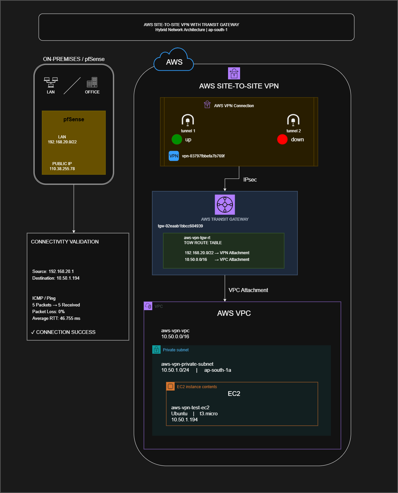

# AWS Site-to-Site VPN with pfSense & Transit Gateway

> **Hybrid Cloud Networking Lab — On-Premises pfSense → AWS Site-to-Site VPN → Transit Gateway → Private VPC → EC2**

## Architecture



---

## Project Overview

This project demonstrates a practical hybrid cloud networking architecture connecting an on-premises **pfSense firewall** to a private AWS environment using:

* AWS Site-to-Site IPsec VPN
* AWS Transit Gateway
* Static routing
* AWS VPC routing
* Private EC2
* End-to-end connectivity validation

The lab was designed to establish private communication between the on-premises network and an AWS VPC without exposing the EC2 instance through a public IPv4 address.

### Connectivity

```text
On-Premises Network
192.168.20.0/22
        |
        v
     pfSense
   192.168.20.1
        |
        | IPsec Site-to-Site VPN
        v
AWS Site-to-Site VPN
        |
        v
Transit Gateway
        |
        v
AWS VPC
10.50.0.0/16
        |
        v
Private Subnet
10.50.1.0/24
        |
        v
EC2
10.50.1.194
```

---

## Project Objectives

The main objectives of this lab were:

1. Configure pfSense as an on-premises customer gateway.
2. Establish an AWS Site-to-Site IPsec VPN.
3. Connect the VPN to AWS Transit Gateway.
4. Create a dedicated Transit Gateway route table.
5. Configure VPN and VPC routing.
6. Deploy a private EC2 test instance.
7. Validate end-to-end private connectivity.
8. Troubleshoot the VPN and routing path.
9. Document the complete hybrid network architecture.
10. Clean up the AWS resources after validation.

---

## Network Topology

### On-Premises Network

| Component          | Configuration     |
| ------------------ | ----------------- |
| Office LAN         | `192.168.20.0/22` |
| pfSense LAN IP     | `192.168.20.1/22` |
| WAN                | `192.168.10.6/24` |
| WAN Gateway        | `192.168.10.1`    |
| Windwave Gateway   | `110.38.255.77`   |
| SkyNet Gateway     | `103.131.10.77`   |
| VPN Public IP Used | `110.38.255.78`   |

### AWS Network

| Component         | Configuration            |
| ----------------- | ------------------------ |
| AWS Region        | `ap-south-1`             |
| VPC Name          | `aws-vpn-vpc`            |
| VPC CIDR          | `10.50.0.0/16`           |
| Private Subnet    | `aws-vpn-private-subnet` |
| Subnet CIDR       | `10.50.1.0/24`           |
| Availability Zone | `ap-south-1a`            |

---

## AWS Transit Gateway

### Transit Gateway

```text
TGW ID:
tgw-02eaab1bbcc604939
```

### VPC Attachment

```text
Attachment:
tgw-attach-02e534ce3c3c0e97f

Resource:
vpc-0227621fd4b013536
```

### VPN Attachment

```text
Attachment:
tgw-attach-0dc3b0bd73d852b9d

Resource:
vpn-03797fbbefa7b769f
```

### Dedicated TGW Route Table

```text
Name:
aws-vpn-tgw-rt

Route Table ID:
tgw-rtb-0bf3507f7aa502a7b
```

---

## AWS Site-to-Site VPN

| Component                | Value                   |
| ------------------------ | ----------------------- |
| VPN Connection           | `vpn-03797fbbefa7b769f` |
| Customer Gateway         | `cgw-0949341409982eaf9` |
| Customer Gateway Address | `110.38.255.78`         |
| VPN Type                 | `ipsec.1`               |
| Routing                  | Static                  |
| Authentication           | Pre-Shared Key          |

### Tunnel 1

| Parameter      | Value                |
| -------------- | -------------------- |
| AWS Outside IP | `13.126.13.147`      |
| Inside CIDR    | `169.254.243.60/30`  |
| Status         | **UP / Established** |

### Tunnel 2

| Parameter      | Value                |
| -------------- | -------------------- |
| AWS Outside IP | `13.204.119.254`     |
| Inside CIDR    | `169.254.136.124/30` |
| Status         | **DOWN**             |

> Tunnel 1 was used for the successful end-to-end validation. Tunnel 2 high-availability configuration was not completed during this lab.

---

## IPsec Configuration

### Phase 1

```text
IKE Version:        IKEv1
Internet Protocol:  IPv4
Interface:          WINDWAVE
Authentication:     Mutual PSK
Encryption:         AES128
Hash:               SHA1
DH Group:           2
Lifetime:           28800 seconds
NAT Traversal:      Auto
MOBIKE:             Disabled
DPD:                Enabled
DPD Delay:          10 seconds
DPD Max Failures:   3
```

### Phase 2

```text
Mode:               Tunnel IPv4
Local Network:      192.168.20.0/22
Remote Network:     10.50.0.0/16
Protocol:           ESP
Encryption:         AES128
Hash:               SHA1
PFS:                Group 2
Lifetime:           3600 seconds
```

---

## Transit Gateway Routing

The dedicated Transit Gateway route table was configured to provide connectivity between the VPN attachment and the VPC attachment.

### TGW Route Table

| Destination       | Target         | Route Type | State  |
| ----------------- | -------------- | ---------- | ------ |
| `10.50.0.0/16`    | VPC Attachment | Propagated | Active |
| `192.168.20.0/22` | VPN Attachment | Static     | Active |

### Routing Logic

```text
Office Network
192.168.20.0/22
        |
        v
VPN Attachment
        |
        v
Transit Gateway
        |
        v
VPC Attachment
        |
        v
10.50.0.0/16
```

---

## AWS VPC Routing

The private subnet route table contained:

| Destination       | Target          | State  |
| ----------------- | --------------- | ------ |
| `10.50.0.0/16`    | Local           | Active |
| `192.168.20.0/22` | Transit Gateway | Active |

This route allowed AWS resources to return traffic toward the on-premises network.

---

## Private EC2 Test Instance

The test instance was deployed inside the private subnet without a public IPv4 address.

```text
Name:
aws-vpn-test-ec2

Instance ID:
i-06cd9d21cc16e98ab

Private IP:
10.50.1.194

Subnet:
10.50.1.0/24

Instance Type:
t3.micro

Operating System:
Ubuntu

Public IPv4:
None
```

The private-only design was intentional so that connectivity could be validated through the hybrid VPN path instead of through the public internet.

---

## Security Group

The test security group was:

```text
aws-vpn-test-sg
```

The SSH access rule used the on-premises network:

```text
TCP 22
Source: 192.168.20.0/22
```

ICMP was temporarily allowed from the on-premises network for connectivity validation.

---

## Connectivity Validation

The primary end-to-end test was performed from pfSense toward the private EC2 instance.

### Test

```text
Source:
192.168.20.1

Destination:
10.50.1.194
```

### Result

```text
5 packets transmitted
5 packets received
0.0% packet loss

Average RTT:
46.755 ms
```

### Validation Status

**SUCCESS**

The test demonstrated the following path:

```text
pfSense
    |
    | IPsec
    v
AWS Site-to-Site VPN
    |
    v
Transit Gateway
    |
    v
AWS VPC
    |
    v
Private Subnet
    |
    v
EC2 10.50.1.194
```

---

## Troubleshooting Performed

The VPN was not initially established on pfSense.

The troubleshooting process focused on identifying the actual failure point before making configuration changes.

The following components were verified:

### pfSense

* IKE Phase 1
* IPsec Security Associations
* IPsec Security Policies
* Phase 2 traffic selectors
* Local and remote CIDRs
* Tunnel status

### AWS

* VPN connection state
* VPN tunnel state
* Transit Gateway attachment state
* TGW route table association
* TGW propagation
* TGW routes
* VPC route table
* EC2 security group

### Final Findings

The successful path required:

```text
192.168.20.0/22
        |
        v
VPN Attachment
        |
        v
Transit Gateway
        |
        v
VPC Attachment
        |
        v
10.50.0.0/16
```

The AWS VPC route table also required:

```text
192.168.20.0/22
        |
        v
Transit Gateway
```

After the required routing configuration was in place, the pfSense-to-EC2 connectivity test succeeded with **0% packet loss**.

---

## Key Learning Outcomes

This project provided practical experience in:

* AWS Site-to-Site VPN
* IPsec VPN architecture
* pfSense VPN configuration
* IKE Phase 1
* IPsec Phase 2
* Static VPN routing
* Transit Gateway
* Transit Gateway route tables
* VPN attachments
* VPC attachments
* Route propagation
* VPC route tables
* Private subnet networking
* EC2 networking
* Hybrid cloud connectivity
* Network troubleshooting
* End-to-end connectivity validation

---

## Evidence

The repository contains supporting screenshots showing the implementation and validation process.

```text
screenshots/
│
├── 01-pfsense-ipsec-tunnel-established.png
├── 02-pfsense-ipsec-spd.png
├── 03-pfsense-ipsec-sad.png
├── 04-tgw-vpc-attachment.png
├── 05-tgw-vpn-attachment.png
├── 06-tgw-vpn-route-table.png
├── 07-tgw-vpc-propagation.png
├── 08-vpc-route-to-tgw.png
├── 09-ec2-private-instance.png
└── 10-pfsense-to-aws-ping-success.png
```

The screenshots are stored as project evidence and are **not displayed individually inside this README**.

---

## Architecture Source

The architecture diagram was created using **draw.io**.

```text
architecture/
│
├── architecture-diagram.png
└── architecture-diagram.drawio
```

The PNG is displayed at the top of this README, while the `.drawio` file is included as the editable source.

---

## Repository Structure

```text
aws-site-to-site-vpn-lab/
│
├── architecture/
│   ├── architecture-diagram.png
│   └── architecture-diagram.drawio
│
├── screenshots/
│   ├── 01-pfsense-ipsec-tunnel-established.png
│   ├── 02-pfsense-ipsec-spd.png
│   ├── 03-pfsense-ipsec-sad.png
│   ├── 04-tgw-vpc-attachment.png
│   ├── 05-tgw-vpn-attachment.png
│   ├── 06-tgw-vpn-route-table.png
│   ├── 07-tgw-vpc-propagation.png
│   ├── 08-vpc-route-to-tgw.png
│   ├── 09-ec2-private-instance.png
│   └── 10-pfsense-to-aws-ping-success.png
│
├── README.md
└── README.txt
```

---

## Security Notice

Sensitive information must never be committed to this repository.

Do not upload:

* VPN pre-shared keys
* AWS access keys
* AWS secret keys
* Private SSH keys
* `.pem` files
* Certificates
* Passwords
* pfSense configuration backups
* VPN configuration files containing secrets

Only non-sensitive architecture, configuration, routing information, screenshots, and documentation should be published.

---

## Project Status

| Component               | Status       |
| ----------------------- | ------------ |
| pfSense configuration   | ✅ Complete   |
| IPsec Tunnel 1          | 🟢 UP        |
| IPsec Tunnel 2          | 🔴 DOWN      |
| AWS Site-to-Site VPN    | ✅ Validated  |
| Customer Gateway        | ✅ Configured |
| Transit Gateway         | ✅ Configured |
| VPN Attachment          | ✅ Configured |
| VPC Attachment          | ✅ Configured |
| TGW Route Table         | ✅ Configured |
| TGW Routing             | ✅ Validated  |
| VPC Routing             | ✅ Validated  |
| Private EC2             | ✅ Tested     |
| End-to-End Connectivity | ✅ Successful |
| AWS Lab Cleanup         | ✅ Completed  |

---

## Final Result

The lab successfully demonstrated a hybrid cloud connection between an on-premises pfSense network and a private AWS VPC.

### Final Connectivity

```text
On-Premises
192.168.20.0/22
      |
      v
pfSense
192.168.20.1
      |
      v
AWS Site-to-Site IPsec VPN
      |
      v
Transit Gateway
      |
      v
AWS VPC
10.50.0.0/16
      |
      v
Private Subnet
10.50.1.0/24
      |
      v
EC2
10.50.1.194
```

### Validation

```text
5 packets transmitted
5 packets received
0.0% packet loss
~46.8 ms average latency
```

**Status: END-TO-END CONNECTIVITY VERIFIED**

---

## Technologies

**AWS VPC · AWS Transit Gateway · AWS Site-to-Site VPN · IPsec · pfSense · EC2 · Linux · Static Routing · Hybrid Cloud Networking**

---

## Author

**Mohsin Ali**

Cloud Infrastructure / Cloud Networking Portfolio Project
